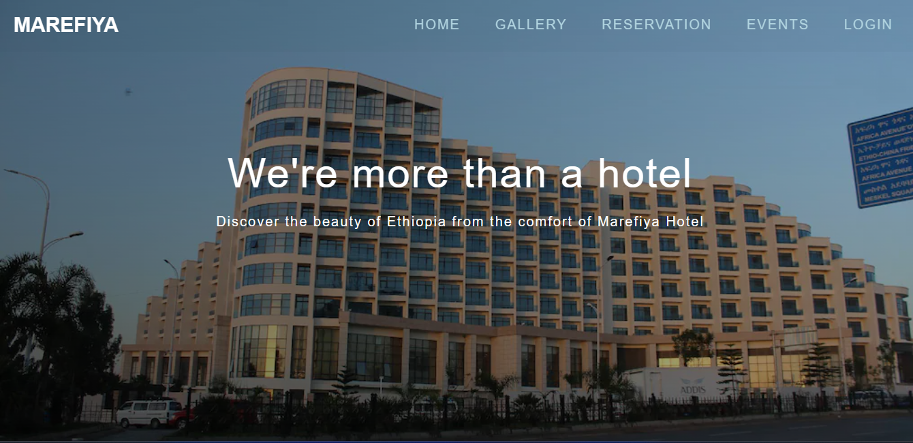
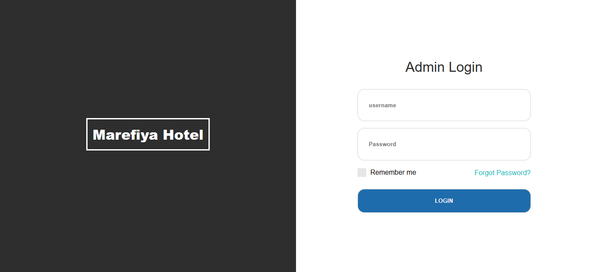

# Marefiya - Full Hotel Website



This project is a Simple Hotel Website with a Fully Functional Hotel Management Admin Portal. The website is implemented using pure PHP object-oriented programming and HTML, CSS, and JS.

## Team Members

- Gemechis Elias
- Habteyesus Tadese
- Duresa Fayisa
- Etsubdink Hayelom
- Firkresilase



## Technologies Used

- PHP
- HTML
- CSS
- JavaScript

## Getting Started

To get started with the project, follow these steps:

1. Clone the repository:

   ```bash
   git clone https://github.com/gemechis-elias/hotel-website.git

2. Set up a local web server environment (e.g., XAMPP, WAMP, MAMP) and ensure it has PHP support.

3. Import the database schema provided in the database.sql file.

4. Update the database configuration in the config.php file with your database credentials.

5. Launch the website by accessing it through your web server's URL.

## Contributions
We welcome contributions from the community to enhance the project. If you find any issues or have suggestions for improvements, please feel free to open a new issue or submit a pull request.

## Contact
For any inquiries or questions regarding the project, please contact us
